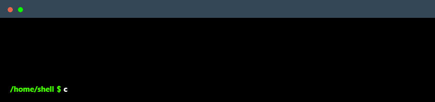

# MyShell

MyShell is a simple Unix-like shell implemented in C, designed for educational purposes and personal use. It provides a basic command-line interface and supports common shell functionalities.

## Features

- **Command Execution**: Execute external commands with arguments.
- **Built-in Commands**: Includes support for `env` and `exit` built-in commands.
- **Path Resolution**: Resolves the full path of executable files using the system's PATH environment variable.
- **Interactive Mode**: Provides an interactive shell prompt.
- **Script Execution**: Execute shell scripts by providing the script file as an argument.

## Getting Started

These instructions will help you compile and run MyShell on your local machine.

### Prerequisites

- C compiler (e.g., GCC)
- Unix-like operating system (Linux, macOS)

## License

This project is licensed under the terms of the [MIT License](LICENSE).

